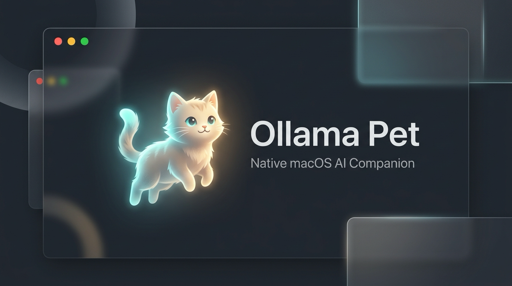

<p align="center">
  
</p>

<h1 align="center">🐾 Ollama Pet</h1>

<p align="center">
  <b>Lightweight, Native macOS Desktop AI Companion built with Swift, SwiftUI, and AppKit</b>
</p>

A local AI desktop companion that lives on your screen — powered entirely by [Ollama](https://ollama.ai) running on your own machine. No cloud, no external API keys, no subscriptions, and zero web runtime overhead. Chat with your pet, watch it dance to your music, schedule reminders that survive restarts, check live weather, track focus with Pomodoro, and monitor real system vitals.

---

## ⚡ Native macOS Architecture

Ollama Pet is built natively for macOS using **Swift**, **SwiftUI**, and **AppKit**:

- 🚀 **Blazing Fast & Lightweight**: Zero Chromium or Node.js overhead, instantaneous startup, and minimal memory usage.
- 🪟 **True Floating NSPanel**: Borderless, transparent floating window with zero window flickering on spawn.
- 🎯 **Anchor-Aware Dynamic Geometry**: Control drawer expands intelligently away from screen edges based on quadrant detection, preserving pet screen coordinates with 0px cumulative drift.
- 🖐️ **Fluid Draggable Interface**: Mouse-offset dragging with a 5px threshold (click vs. drag separation) and corner snapping.
- 🖥️ **Multi-Monitor Safe**: Window bounds are automatically constrained to active display `workArea` boundaries.
- ⚡ **Apple Silicon Optimized**: Native ARM64 Mach-O binary compiled for macOS 13+ (Ventura, Sonoma, Sequoia).
- 🐾 **Menu Bar & Global Hotkey**: Access via the status bar item (`🐾`) or toggle visibility globally anytime using <kbd>Cmd</kbd> + <kbd>Shift</kbd> + <kbd>P</kbd>.

---

## ✨ Features

| Feature | What it does |
|---|---|
| 💬 **AI Chat & Streaming Voice Assistant** | Talk to your pet using local Ollama models (`llama3.2`, `gemma2`, `phi3`, etc.). Features real-time token streaming with conversational eye tracking, Push-to-Talk STT (`SFSpeechRecognizer`), and speech synthesis (`AVSpeechSynthesizer`). |
| 🧬 **5-Layer Composable Render Tree** | Hardware-accelerated SwiftUI Canvas render tree (`Aura -> Body Shell -> Clothing/Skin -> Facial Features -> Floating Accessories`) with procedural lighting, ambient day/night rim light, and reactive CPU thermal shifts. |
| 🫧 **Selectable Character Structural Models** | Choose between authentic **Classic Species** (7 characters), **Kinetic Slime** (elastic bezier morphing), **Hovering Cyber-Sentry** (segmented floating plates & pulse visors), and **Pixel-Chibi Beast** (articulated limbs & ears). |
| 🏃 **Procedural Motion Kinematics** | Explicit `CharacterMotionStateMachine` featuring organic breathing, random micro-blinks, gaze saccades, spring squash/stretch, thought sparks, and multi-phase dance choreography with celebratory confetti bursts. |
| 🚶 **Gait Presets & Walk Mode** | Supports 3 distinct walk gait presets: **Bouncy March** (high vertical pop), **Stealth Prowl** (low predatory glide), and **Hover Glide** (inertial float with secondary delay) with speed controls ($0.5\times - 2.0\times$) and test previews. |
| 🌦️ **Persistent Multi-City Climate Vault** | Add, manage, and switch arbitrary global cities permanently stored in `~/ollama-pet-data.json`. Directly influences pet stage rendering with dynamic rain ripples, snow accumulation, fog blur, and golden-hour sunbeams. |
| 🪟 **True Desktop Pass-Through Hit-Testing** | Non-transparent geometry evaluation allows complete pass-through clicks for underlying desktop apps while preserving mouse dragging and interaction on the pet and drawer. |
| ⚡ **Adaptive Resource Throttling** | Dynamically reduces animation frame rates (60fps -> 30fps) and monitoring intervals when operating on battery power to conserve energy. |
| 👁️ **Optional Vision Guardian** | Privacy-first Apple Vision human presence detection. Low-res ($640\times 480$, 5s/10s/30s) scans detect presence and desk return. Off by default. |
| 🖥️ **Screen Context Awareness** | Frontmost app detection without continuous screen recording. Off by default. |
| 🍅 **Focus Guardian & Hydration** | 25-minute Pomodoro timer coordinated with presence and periodic hydration reminders. |
| 🎵 **Music & Dance** | AVFoundation metering powers a beat visualizer with audio-reactive choreography. |
| ⏰ **Persistent Reminders** | Reminders that survive restarts, delivered via `UNUserNotificationCenter`. |
| 📊 **System Vitals** | Real Mach kernel CPU load, IOKit battery percentage/charging status, uptime, and active apps. |
| ⌨️ **Customizable Shortcuts** | Assign custom global hotkeys for Pet Toggle, Voice Assistant Push-to-Talk, and Settings. |
| 🔐 **Privacy Center** | Explicit status monitors and toggle controls for Microphone, Speech, Camera, and Screen Recording. |

---

## 🛠 Project Structure

```text
ollama-pet/
├── OllamaPetNative/               # Native macOS Swift codebase
│   ├── Package.swift              # SPM package definition
│   └── Sources/OllamaPet/
│       ├── AppDelegate.swift      # Menu bar status item, hotkey & app lifecycle
│       ├── CharacterMotionStateMachine.swift # Kinematic states, breathing, micro-blinks, gaits & particles
│       ├── ChatView.swift         # Multi-tab SwiftUI drawer (Chat, Climate Vault, Focus, Settings)
│       ├── DataManager.swift      # Persistent storage & UNUserNotificationCenter alerts
│       ├── FocusGuardian.swift    # Pomodoro session coordinator & hydration alerts
│       ├── Models.swift           # Characters, moods, climate models, preferences & shortcuts
│       ├── MusicManager.swift     # AVFoundation audio player & audio metering
│       ├── OllamaClient.swift     # URLSession client with real-time token streaming
│       ├── PetArtwork.swift       # SVG vector rendering for classic species
│       ├── PetCanvasRenderer.swift # 5-layer composable render tree & procedural color engine
│       ├── PetStageView.swift     # TimelineView & SwiftUI Canvas physics pet stage
│       ├── PetState.swift         # Animation, mood, Pomodoro, and game state machine
│       ├── PetWindowController.swift # NSPanel with geometry-aware hit-testing & pass-through
│       ├── ScreenGuardian.swift   # Privacy-first frontmost app context analyzer
│       ├── ShortcutManager.swift  # Global keyboard event monitors & conflict resolver
│       ├── SoundEffects.swift     # AudioToolbox sound effects
│       ├── SystemMonitor.swift    # Mach host processor stats, IOKit power & dynamic throttling
│       ├── VisionGuardian.swift   # Camera awareness & Apple Vision human detection
│       ├── VoiceAssistant.swift   # Push-to-talk STT & TTS speech synthesizer
│       ├── WalkerManager.swift    # TimelineView & Canvas bottom-screen walk animation
│       ├── WeatherService.swift   # Multi-City Climate Vault service via Open-Meteo
│       └── main.swift             # Native app entry point
├── build-native.sh                # Automated build & packaging script for Native macOS .app
├── install.sh                     # Automated build & install script into /Applications
├── icon.icns                      # High-resolution macOS app icon bundle
├── icon.png                       # App icon asset
├── banner.png                     # Project banner asset
├── LICENSE                        # Project license
├── .gitignore                     # Git ignore rules for native builds
└── README.md                      # Documentation
```

---

## 🚀 Building & Running

### 1. Requirements

- **macOS**: macOS 13.0 or later (Apple Silicon or Intel).
- **Xcode Command Line Tools**: `xcode-select --install`
- **Ollama**: Download from [ollama.ai](https://ollama.ai) and pull any model:
  ```bash
  ollama pull llama3.2
  # or
  ollama pull phi3
  ```

---

### 2. Install to Applications (Recommended)

To build and automatically install directly into your macOS `/Applications` folder:

```bash
chmod +x install.sh
./install.sh
```

This compiles the release binary and copies `OllamaPet.app` directly into `/Applications`, making it instantly searchable in Spotlight and Launchpad.

---

### 3. Alternative: Build & Run Locally

To compile and run directly from the workspace folder:

```bash
chmod +x build-native.sh
./build-native.sh
open dist-native/OllamaPet.app
```

> **Note**: Whenever you launch Ollama Pet outside your Applications folder (e.g. from Downloads or this repository), the app will automatically prompt:
> *"Move to Applications Folder?"*
> You can also click the status bar icon (`🐾`) at any time and choose **"📥 Move to Applications Folder..."**.

---

## ⌨️ Shortcuts & Controls

- **Click Pet**: Open or close the interactive drawer.
- **Drag Pet**: Reposition anywhere on screen with automatic corner snapping.
- **5 Clicks in a Row**: Triggers an instant celebration dance party! 🎉
- <kbd>Cmd</kbd> + <kbd>Shift</kbd> + <kbd>P</kbd>: Toggle pet visibility globally on macOS.
- **Status Bar Menu (`🐾`)**: Switch characters, toggle launch at login, or quit the app.

---

## 📄 License

MIT License. See [LICENSE](LICENSE) for details.
